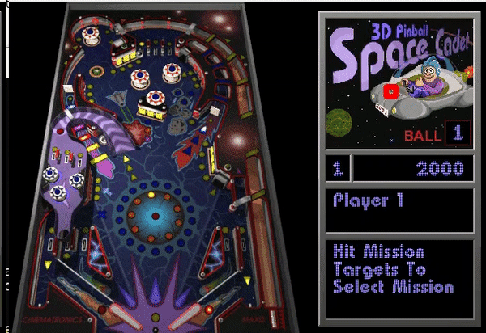
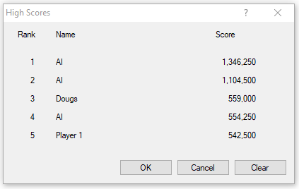

# SpaceCadettTemplateMatching
This application uses Computer Vision technique called **Template Matching** to help our script to play the classic 3D Pinball Space Cadet.

## Getting Started

### Requirements 

I used conda for package environment management, So if you want to run the application you can run create one environment with

```
conda create --name spacecadetttemplatematch python=3.7
```
with this environment activated you can install opencv library with the following comand.

```
conda install opencv=3.4.2
```

Is important to choose the right version of opencv, because if you choose another version it can ask for downgrading your python version and we don't want that. :)

You could also use pip for package environment management and install the required packages with

```
pip3 install -r requirements.txt
```

# How to use this code to detect other things

If you just want to re-execute my application on your PC to see the results there is not much to say other than clone the repo install conda environment or pip environment required packages in the requirements.txt file. However if you want to know the steps I followed to be able to apply Template Matching technique, to create your own code for detecting other stuff follow these directions:

1. **Separate the object or template you want to match against**  
Choose the object you want to detect. Place it in the assets folder folders. It is important to say that the way opencv Template Match works is by trying to match the selected template rectangle with each an every rectangle in your picture. If there is any tiny diference it will probably not detect, so be aware of that when selecting Template Matching to play around in your projects.

2. **Choose the best Template Matching Algorithm**  
Try first to run some tests with the Template Matching of your template using the different methods disposed in the code. I checked and for my particular example opencv.TM_CCORR_NORMED works better. 

You can see all of them here:
```
methods = [opencv.TM_CCOEFF, opencv.TM_CCOEFF_NORMED, opencv.TM_CCORR,
            opencv.TM_CCORR_NORMED, opencv.TM_SQDIFF, opencv.TM_SQDIFF_NORMED]
```

3. **Check how are you getting screenshots**  
I am only asking you to do that, because if you are using an approach that gives you a smaller amount of frames per second(FPS), it will make harder for your script to take decisions. Feel free to use my WindowCapture object if you are doing your project on Windows.  

You can check the FPS by doing the following:
```
# Do that before your loop starts
loop_time = time()
...
# Do that right after taking a screenshot
print('FPS = {}'.format(1 / (time()-loop_time)))
loop_time = time()
```

4. **Smart Heuristics lead to better performance**  
This is where things get tricky, because the Heuristics in your script generally use some heavy logic, if you check lots of things it impacts directly your FPS and the decision-making of your script. I encourage you to try lots of different solutions for your Heuristics and only maintain the best ones regarding result and performance.

# Results

After tweaking the Heuristics to see which ones better fit my problem and are not too costly performance-wise, these were the results:

The Ball template was matched most of the times. The color of the rectangle around the ball means the direction it is going(blue="down&right", red="down&left", green="up"):


The script was so good at playing the game that it beat my scores many times:  
